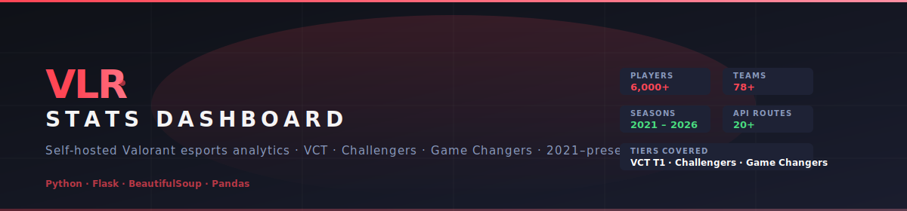
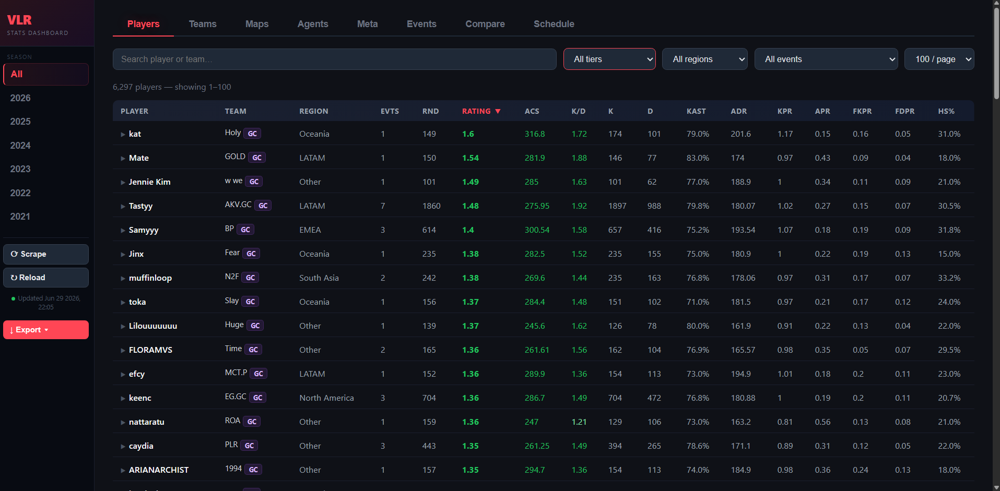
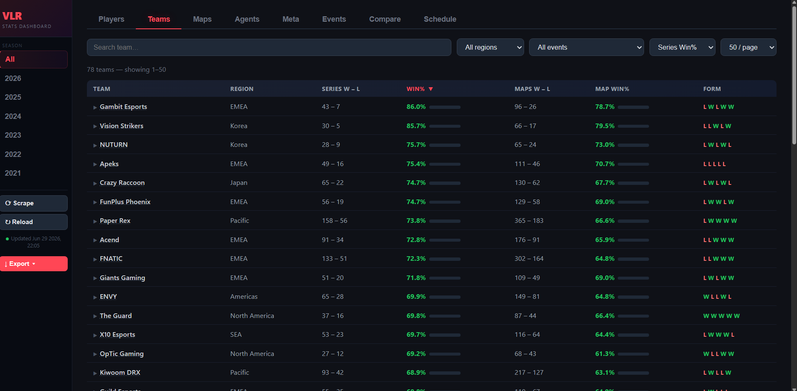
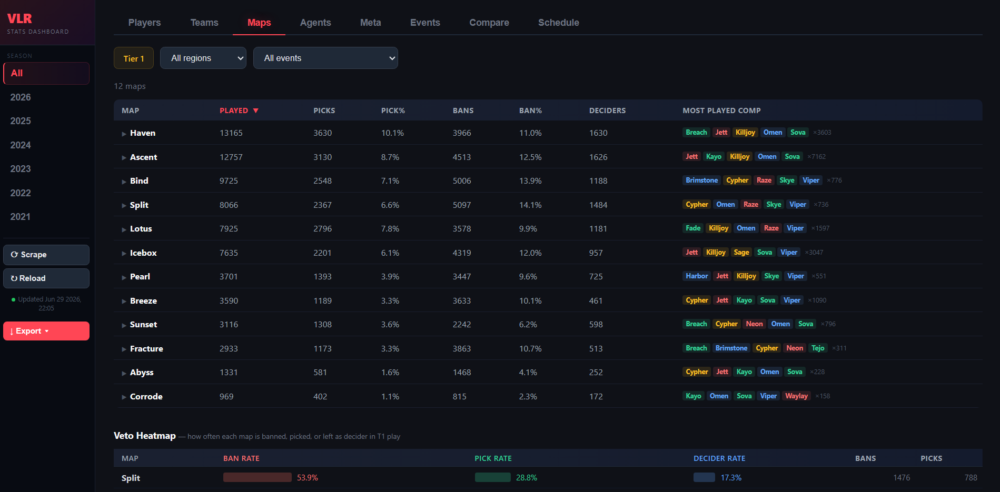
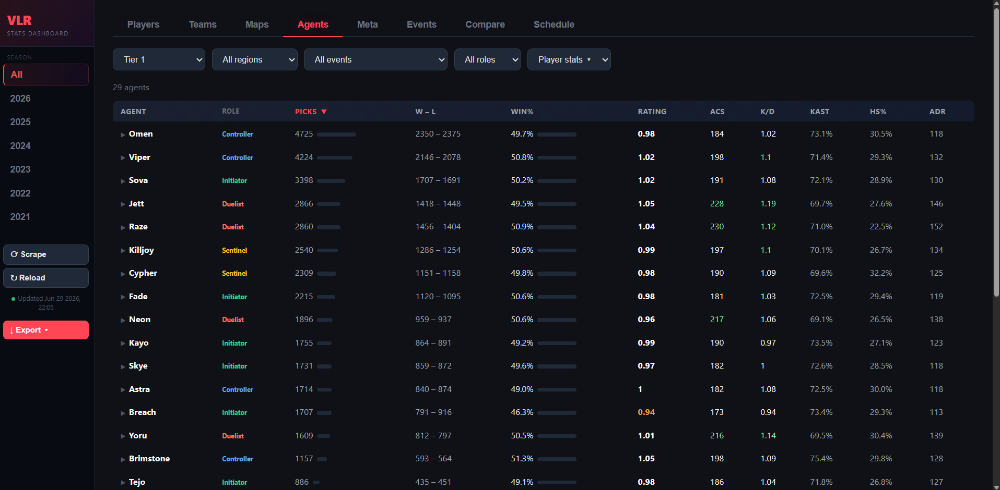
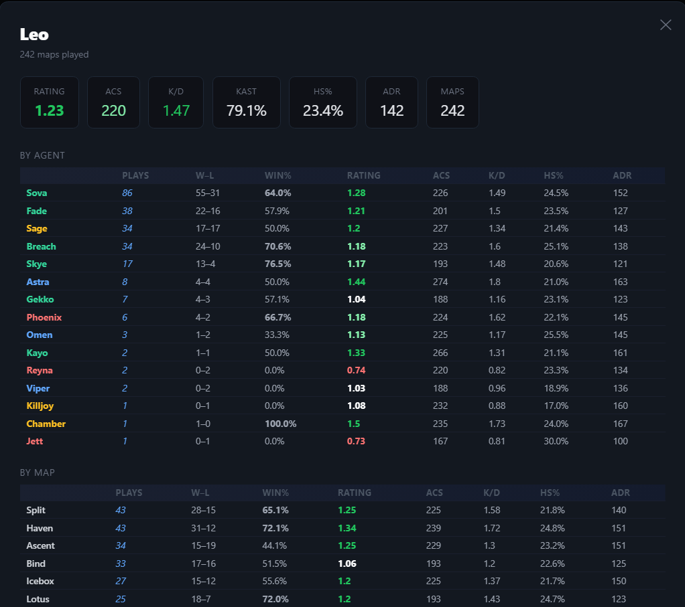
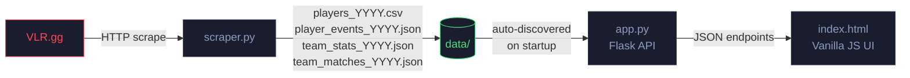

<div align="center">
  
</div>

<br/>

<div align="center">

[](https://python.org)
[](https://flask.palletsprojects.com)
[](https://opensource.org/licenses/MIT)
[]()
[]()

**Self-hosted Valorant esports analytics dashboard.** Scrapes VLR.gg for player, team, agent, and map data across VCT, Challengers, and Game Changers — all in a fast, zero-dependency web UI.

[Quick Start](#-quick-start) · [Features](#-features) · [How It Works](#-how-it-works) · [API Reference](#-api-reference) · [Configuration](#-configuration)

</div>

---

## Preview

<div align="center">

**Players Leaderboard** — rounds-weighted aggregate stats across an entire season



<br/><br/>

<table>
  <tr>
    <td width="50%">
      <b>Teams</b> — series win %, map record, recent form
      <br/><br/>
      
    </td>
    <td width="50%">
      <b>Maps</b> — pick/ban heatmap + most played compositions
      <br/><br/>
      
    </td>
  </tr>
  <tr>
    <td width="50%">
      <b>Agents</b> — pick rate, win rate, stats by role across all tiers
      <br/><br/>
      
    </td>
    <td width="50%">
      <b>Player Profile</b> — per-agent and per-map career breakdown
      <br/><br/>
      
    </td>
  </tr>
</table>

</div>

---

## Features

| View | What you get |
|---|---|
| **Players** | Rounds-weighted leaderboard (Rating, ACS, K/D, KAST, ADR, KPR, APR, FKPR, FDPR, HS%) · filter by tier, region, team, minimum rounds · sub/stand-in detection |
| **Teams** | Series and map win rates · per-map W-L-pick-ban breakdown · full match history · recent form |
| **Maps** | Pick %, ban %, decider rate · attacker/defender side win rates · top comps per map · veto heatmap |
| **Agents** | Pick rate, win rate · per-role breakdown · top players · per-map performance |
| **Meta** | Agent-vs-agent and comp-vs-comp matchup matrices |
| **Events** | Per-event player leaderboards going back to 2021 |
| **Compare** | Head-to-head between any two players or teams |
| **Schedule** | Upcoming match schedule with team and event info |
| **Player Profile** | Career stats by agent and map · team history · rating trend |
| **Live Re-scrape** | Trigger a full data refresh from the UI without restarting the server |

---

## Quick Start

**Option A — Python**

```bash
git clone https://github.com/rafouslmao/VLR.gg-Stats-Dashboard.git
cd VLR.gg-Stats-Dashboard
pip install -r requirements.txt
# Download data.zip from the latest GitHub Release and unzip it
unzip data.zip
python app.py
```

**Option B — Docker**

```bash
git clone https://github.com/rafouslmao/VLR.gg-Stats-Dashboard.git
cd VLR.gg-Stats-Dashboard
# Download data.zip from the latest GitHub Release and unzip it
docker compose up
```

Open **http://127.0.0.1:8080** — no build step, no database.

> **Want fresh data?** Click the **Scrape** button in the sidebar to trigger a background scrape for any year, or run `python scraper.py --year 2026` from the terminal. A full season scrape takes **roughly 10-30 minutes** depending on the number of events and your connection speed. Incremental scrapes (rerunning the same year) are much faster — only new matches are fetched.

---

## How It Works



### Player aggregation

The scraper does more than just dump raw rows:

1. **Event discovery** — finds all `completed` / `ongoing` events for a given year, classifies each as Tier 1 (VCT) / Tier 2 (Challengers) / Game Changers, and tags a region.
2. **Junk stage filtering** — qualifiers, promotion, and relegation stages are detected and dropped so they don't dilute season stats.
3. **Player ID grouping** — players are grouped by their VLR profile ID, not their name, so aliases and mid-season transfers don't split a player's record.
4. **Best-tier aggregation** — each player's headline stats are rounds-weighted averages from their *highest* competitive tier only. Lower-tier appearances stay in the event history view but don't affect the leaderboard.
5. **Sub detection** — the scraper fetches current T1 rosters and flags any T1 player not on an active team as `IsSub=1`, applying a relaxed 50-round minimum (vs. 100 for starters).

### Team aggregation

1. Pulls match lists from every T1 event.
2. Fetches every match page in parallel (8 workers) for map scores, vetoes, picks/bans, and per-map player stats.
3. Showmatches are filtered out via URL pattern + score sanity checks.
4. Team rebrands are resolved through the `TEAM_MERGES` config so historical data stays connected.

---

## Project Structure

```
VLR.gg-Stats-Dashboard/
├── app.py              # Flask server + all 20+ API endpoints
├── scraper.py          # Unified scraper — players, teams, matches, schedule
├── requirements.txt    # Pinned Python dependencies
├── Dockerfile          # Container build
├── docker-compose.yml  # One-command start
├── templates/
│   └── index.html      # Single-page dashboard (vanilla JS, no build step)
├── tests/
│   ├── conftest.py     # Pytest fixtures with minimal fixture data
│   └── test_api.py     # 46 smoke tests covering all API endpoints
├── data/               # Generated by scraper (gitignored — see Releases)
│   ├── players_YYYY.csv
│   ├── player_events_YYYY.json
│   ├── player_team_stats_YYYY.json
│   ├── team_stats_YYYY.json
│   ├── team_matches_YYYY.json
│   ├── raw_matches_YYYY.json
│   └── schedule.json
└── docs/               # README assets (banner, screenshots)
```

Data files are **auto-discovered** — drop in a new year's files and they merge in automatically on next startup.

---

## API Reference

<details>
<summary><b>Players</b></summary>

| Endpoint | Description |
|---|---|
| `GET /api/players` | Filtered + paginated leaderboard (`tier`, `region`, `team`, `year`, `page`, `per_page`) |
| `GET /api/player/<id>/events` | Player's per-event history |
| `GET /api/player/<id>/trend` | Rating trend over time |
| `GET /api/player/<id>/team-history` | Team history scraped from VLR profile |
| `GET /api/player/profile?name=...` | Full profile: headline stats, by-agent, by-map |
| `GET /api/player-h2h?a=...&b=...` | Head-to-head between two players |

</details>

<details>
<summary><b>Teams</b></summary>

| Endpoint | Description |
|---|---|
| `GET /api/teams` | Team leaderboard (`year`, `tier`, `region`) |
| `GET /api/team/<id>/matches` | Full match history |
| `GET /api/team/<id>/detail` | Team profile with maps, roster |
| `GET /api/team/<id>/roster` | Current roster from VLR |
| `GET /api/team/<id>/trend` | Win-rate trend over time |
| `GET /api/h2h?a=...&b=...` | Head-to-head between two teams |

</details>

<details>
<summary><b>Maps, Agents & Meta</b></summary>

| Endpoint | Description |
|---|---|
| `GET /api/maps` | Per-map stats — pick/ban/decider, top agents, top comps |
| `GET /api/agents` | Per-agent stats (`tier`, `region`, `year`, `role`) |
| `GET /api/agents/filters` | Available filter values for the agents view |
| `GET /api/meta/matrix` | Agent-vs-agent and comp-vs-comp matrices |

</details>

<details>
<summary><b>Events, Schedule & Utilities</b></summary>

| Endpoint | Description |
|---|---|
| `GET /api/events` | Per-event player leaderboards |
| `GET /api/event_names` | List of all known event names |
| `GET /api/schedule` | Upcoming match schedule |
| `GET /api/match/<id>` | Individual match detail |
| `GET /export/tier1` | Download Tier 1 CSV export as ZIP |
| `POST /api/scrape` | Trigger background re-scrape |
| `GET /api/scrape/status` | Poll scrape progress |

</details>

---

## Configuration

**`scraper.py`** — minimum round thresholds for the leaderboard:

```python
MIN_ROUNDS     = 100   # regular players
MIN_ROUNDS_SUB = 50    # subs / stand-ins
REQUEST_DELAY  = 0.4   # seconds between requests (increase if rate-limited)
```

**`app.py`** — port and team identity merges (for orgs that rebranded mid-history):

```python
TEAM_MERGES = {"ULF Esports": "Eternal Fire"}   # old_name -> new_name
app.run(debug=True, port=8080)
```

---

## Data Coverage

| Season | Players | Teams | Maps / Agents |
|:---:|:---:|:---:|:---:|
| 2021 | ✅ | ✅ | ✅ |
| 2022 | ✅ | ✅ | ✅ |
| 2023 | ✅ | ✅ | ✅ |
| 2024 | ✅ | ✅ | ✅ |
| 2025 | ✅ | ✅ | ✅ |
| 2026 | ✅ | ✅ | ✅ |

Pre-scraped data for all seasons is available as `data.zip` in the [GitHub Releases](https://github.com/rafouslmao/VLR.gg-Stats-Dashboard/releases). Download and unzip it — you're ready to go without running the scraper at all.

---

## Troubleshooting

**Dashboard shows no data / blank tables**
Download `data.zip` from the latest GitHub Release, extract it into a `data/` folder in the project root, and restart. The app won't crash without data but will return empty results.

**Port 8080 already in use**
Change the port in the last line of `app.py`: `app.run(debug=True, port=9090)`.

**Scrape fails or returns partial data**
VLR.gg may be rate-limiting your IP. Increase `REQUEST_DELAY` near the top of `scraper.py` (default `0.4`s) and re-run. The scraper retries failed requests automatically with exponential backoff, so transient errors usually recover on their own.

**`ModuleNotFoundError`**
Run `pip install -r requirements.txt` to install all dependencies.

**Wrong Python version**
The project requires Python 3.10+. Check with `python --version`.

---

## Contributing

PRs are welcome. A few useful areas if you want to dig in:

- **New views** — Schedule and Compare exist but are relatively bare compared to Players/Teams
- **More regions** — the region detection in `scraper.py` uses keyword matching; edge cases welcome
- **Performance** — the Flask server loads everything into memory; a proper cache layer would help for multi-user deployments

**Running the tests**

```bash
pip install pytest
pytest tests/
```

The test suite (46 smoke tests) covers all API endpoints and runs against fixture data — no internet connection or pre-scraped data required.

Open an issue before starting anything large so we can discuss the approach first.

---

## Disclaimer

This project scrapes publicly accessible pages on [VLR.gg](https://www.vlr.gg). It is not affiliated with, endorsed by, or connected to VLR.gg in any way. Use it responsibly — don't hammer their servers, respect their Terms of Service, and don't use scraped data commercially without permission.

---

## License

MIT
